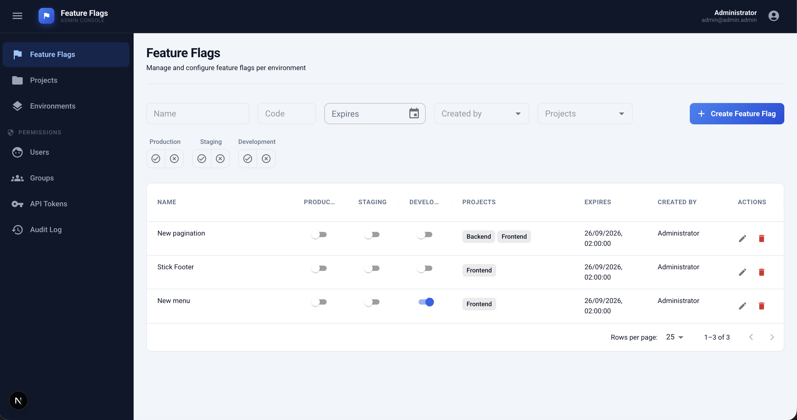
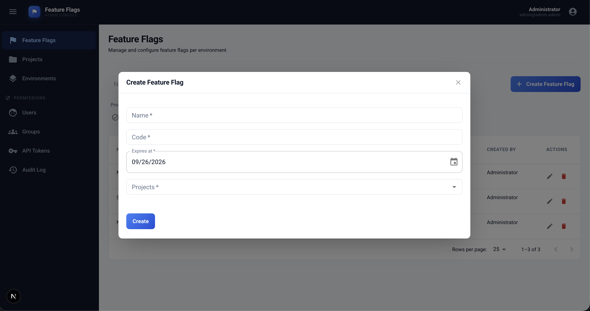
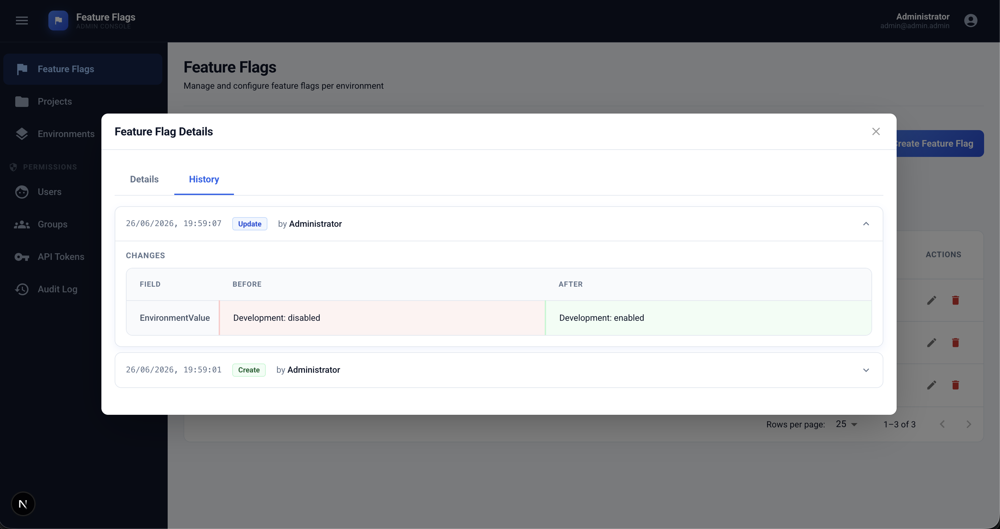

# InShop CRM — API Config Admin Dashboard

**Next.js admin panel for managing feature flags, projects, environments, users, and API tokens.**

The dashboard is the web UI for [InShop CRM API Config](https://github.com/inshop/inshop-crm-api-nest) — a self-hosted feature flag and configuration management system. Use it to create flags, toggle them per environment, manage access control, and issue API tokens for client applications.

| | |
|---|---|
| **Backend API** | [inshop-crm-api-nest](https://github.com/inshop/inshop-crm-api-nest) |
| **Stack** | Next.js 16 · React 19 · MUI · Redux Toolkit · TypeScript |
| **Default URL** | [http://localhost:3000](http://localhost:3000) |

## Table of contents

- [Features](#features)
- [Screenshots](#screenshots)
- [Quick start](#quick-start)
- [Docker](#docker)
- [Prerequisites](#prerequisites)
- [Installation](#installation)
- [Configuration](#configuration)
- [Usage guide](#usage-guide)
- [Generate API client](#generate-api-client)
- [Architecture](#architecture)
- [Testing](#testing)
- [Related documentation](#related-documentation)

## Features

### Feature flags

Central module for boolean feature toggles across projects and environments.

- **List view** — paginated grid with per-environment enable/disable switches
- **Filters** — search by name, code, expiry date, creator, project, and environment
- **Create** — name, unique code, expiry date, and linked projects
- **Edit** — update metadata and set enabled state for each environment
- **Details dialog** — view flag metadata, toggle environments, and browse change history
- **Delete** — remove flags with confirmation

A flag is **active** for a client only when it is linked to the project, enabled in that environment, and not past its expiry date. See [client API docs](https://github.com/inshop/inshop-crm-api-nest#client-feature-flags-api-token) for how apps consume flags.

### Projects

Organize applications or services that share feature flags.

- Fields: name, code, active status
- Full CRUD with role-based permissions

### Environments

Define deployment stages (e.g. `development`, `staging`, `production`).

- Fields: name, code, active status
- Used by feature flag toggles and API token scoping

### Permissions

Role-based access control (RBAC) managed through groups.

#### Users

- Create admin users with name, email, password, group, and active status
- JWT login via the sign-in page

#### Groups

- Named permission groups with module-level role checkboxes
- Roles cover create, update, list, details, and delete per module

#### API tokens

- Issue scoped tokens (`ff_…`) for a single project + environment pair
- Copy-ready `curl` examples for bootstrap and single-flag endpoints
- Regenerate tokens when the plain value is no longer available

#### Audit log

- Searchable history of create, update, delete, login, and logout events
- JSON change diffs for entity modifications
- Per-entity history tabs (e.g. on feature flag details)

## Screenshots

### Feature flags list

Per-environment toggles, filters, and quick actions on the main grid.



### Create feature flag

Dialog to add a new flag with name, code, expiry, and projects.



### Change history

Audit trail for a single feature flag — who changed what and when.



## Quick start

Clone both repositories as **sibling directories** (required for Docker full stack):

```
www/
  inshop-crm-api-nest/
  inshop-crm-admin-next/
```

### Option A — Docker (full stack)

```bash
git clone https://github.com/inshop/inshop-crm-api-nest.git
git clone https://github.com/inshop/inshop-crm-admin-next.git
cd inshop-crm-api-nest
cp .env.example .env          # set JWT_SECRET
cd ../inshop-crm-admin-next
cp .env.local.example .env.local
cd ../inshop-crm-api-nest
docker compose -f docker-compose.dev.yml up
```

- Admin: [http://localhost:3000](http://localhost:3000)
- API: [http://localhost:4000](http://localhost:4000) · Swagger: [http://localhost:4000/api](http://localhost:4000/api)

See [Docker](#docker) for prod setup and running from this repo.

### Option B — Local Node.js

**1. Start the API and database** — see the [API quick start](https://github.com/inshop/inshop-crm-api-nest#quick-start):

```bash
cd inshop-crm-api-nest
yarn install
cp .env.example .env          # set JWT_SECRET
docker compose -f docker-compose.dev.yml up db -d
yarn start:dev
```

**2. Start the dashboard:**

```bash
cd inshop-crm-admin-next
yarn install
cp .env.local.example .env.local
yarn dev
```

**3. Sign in** at [http://localhost:3000](http://localhost:3000) with the default admin credentials:

| Email | Password |
|-------|----------|
| `admin@admin.admin` | `admin@admin.admin` |

## Docker

Compose files run the **full stack** (PostgreSQL + API + admin dashboard). Configuration is read from `../inshop-crm-api-nest/.env` and `.env.local` (this repo).

| File | Purpose |
|------|---------|
| `docker-compose.dev.yml` | Hot reload via `yarn start:dev` / `yarn dev` |
| `docker-compose.prod.yml` | Pre-built images from [GHCR](https://github.com/inshop?tab=packages) |
| `docker-compose.yml` | Local overrides (gitignored) |

### Development

From this repo — pass the API `.env` for database settings:

```bash
cp .env.local.example .env.local
cp ../inshop-crm-api-nest/.env.example ../inshop-crm-api-nest/.env   # set JWT_SECRET

docker compose -f docker-compose.dev.yml --env-file ../inshop-crm-api-nest/.env up
docker compose -f docker-compose.dev.yml --env-file ../inshop-crm-api-nest/.env up -d
docker compose -f docker-compose.dev.yml down
```

Or run from the [API repo](https://github.com/inshop/inshop-crm-api-nest#docker) without `--env-file`.

Inside Docker, `BACKEND_BASE_URL` is overridden to `http://api:4000` (server-side proxy). `NEXT_PUBLIC_BACKEND_BASE_URL` in `.env.local` is still used for client-side `curl` examples (`http://localhost:4000` by default).

### Production

```bash
cp .env.local.example .env.local
# ensure ../inshop-crm-api-nest/.env has JWT_SECRET and DATABASE_PASSWORD

docker compose -f docker-compose.prod.yml --env-file ../inshop-crm-api-nest/.env up -d
```

Uses `ghcr.io/inshop/inshop-crm-admin-next` and `ghcr.io/inshop/inshop-crm-api-nest` images. See [API Docker docs](https://github.com/inshop/inshop-crm-api-nest#docker) for image tags and prod variables.

## Prerequisites

- **Node.js** 22+
- **Yarn**
- **Docker** (for full stack via Compose)
- Running [inshop-crm-api-nest](https://github.com/inshop/inshop-crm-api-nest) backend when not using Docker full stack

## Installation

```bash
yarn install
cp .env.local.example .env.local
```

## Configuration

Edit `.env.local` (for local Node.js and Docker):

| Variable | Required | Description |
|----------|----------|-------------|
| `BACKEND_BASE_URL` | Yes | API base URL for server-side auth proxy (login, logout, refresh) |
| `NEXT_PUBLIC_BACKEND_BASE_URL` | No | Shown in API token `curl` examples; defaults to `http://localhost:4000` |

Example:

```env
BACKEND_BASE_URL=http://localhost:4000
NEXT_PUBLIC_BACKEND_BASE_URL=http://localhost:4000
```

When running the Docker stack, `BACKEND_BASE_URL` is overridden to `http://api:4000` inside the admin container. Keep `NEXT_PUBLIC_BACKEND_BASE_URL=http://localhost:4000` so browser-facing `curl` examples point at the exposed API port.

## Usage guide

### Sign in

Open [http://localhost:3000](http://localhost:3000). The dashboard proxies authentication to `POST /api/admin/auth/login` on the backend and stores the JWT in an HTTP-only cookie.

### Typical workflow

1. **Projects** → create a project (e.g. `My App`, code `my-app`)
2. **Environments** → create environments (e.g. `Staging`, code `staging`)
3. **Feature Flags** → create a flag, assign projects, toggle per environment
4. **Permissions → API Tokens** → create a token scoped to project + environment
5. Use the token in your app — see [client feature flags API](https://github.com/inshop/inshop-crm-api-nest#client-feature-flags-api-token)

### Navigation and permissions

Menu items are hidden when the signed-in user lacks list permission for that module. Manage access under **Permissions → Groups**.

| Section | Route | API resource |
|---------|-------|--------------|
| Feature Flags | `/feature-flags` | `/api/admin/feature-flags` |
| Projects | `/projects` | `/api/admin/projects` |
| Environments | `/environments` | `/api/admin/environments` |
| Users | `/permissions/users` | `/api/admin/users` |
| Groups | `/permissions/groups` | `/api/admin/groups` |
| API Tokens | `/permissions/api-tokens` | `/api/admin/api-tokens` |
| Audit Log | `/permissions/audit` | `/api/admin/audits` |

## Generate API client

The dashboard uses RTK Query types generated from the backend OpenAPI schema. Regenerate after API changes:

```bash
# Backend must be running with Swagger at /api-json
yarn api-generate
```

Fetch the schema manually:

```bash
yarn api-schema:fetch
```

## Architecture

```
Browser → Next.js (port 3000)
            ├── /api/admin/*  → proxy to NestJS API (JWT refresh)
            └── Dashboard pages → RTK Query → /api/admin/*
```

- **UI**: MUI Data Grid, date pickers, form dialogs
- **State**: Redux Toolkit with auto-generated API hooks
- **Auth**: Cookie-based JWT; role checks via `AuthProvider`

## Testing

### Unit and component tests (Vitest + MSW)

No backend required — API calls are mocked.

```bash
yarn test
yarn test:watch
yarn test:coverage
```

### End-to-end tests (Playwright)

```bash
npx playwright install chromium
yarn test:e2e
```

Playwright starts `yarn dev` automatically unless port 3000 is already in use.

For full-stack E2E, start the API and Postgres first — see [API testing](https://github.com/inshop/inshop-crm-api-nest#tests) or run `docker compose -f docker-compose.dev.yml up` from either repo.

CI runs `yarn test`, `yarn build`, and `yarn test:e2e` — see [`.github/workflows/test.yml`](.github/workflows/test.yml).

## Related documentation

- [API repository](https://github.com/inshop/inshop-crm-api-nest) — NestJS backend, Docker setup, REST endpoints, Swagger
- [API authentication](https://github.com/inshop/inshop-crm-api-nest#authentication)
- [Client feature flags API](https://github.com/inshop/inshop-crm-api-nest#client-feature-flags-api-token) — bootstrap and single-flag endpoints for apps
- [API tokens](https://github.com/inshop/inshop-crm-api-nest#admin-api-tokens) — create and manage `ff_…` tokens
- [Permissions and roles](https://github.com/inshop/inshop-crm-api-nest#permissions-and-roles)
